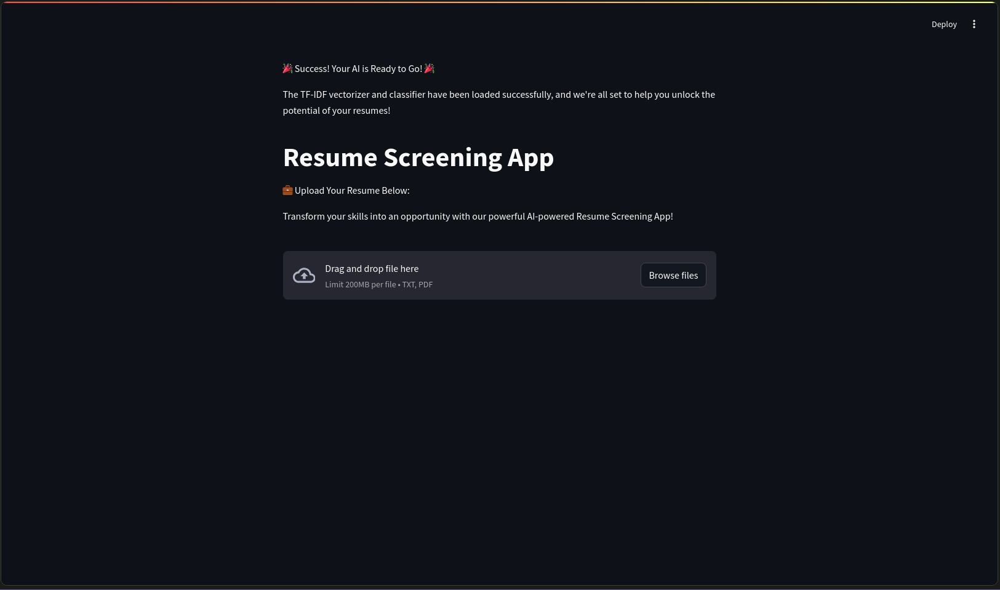
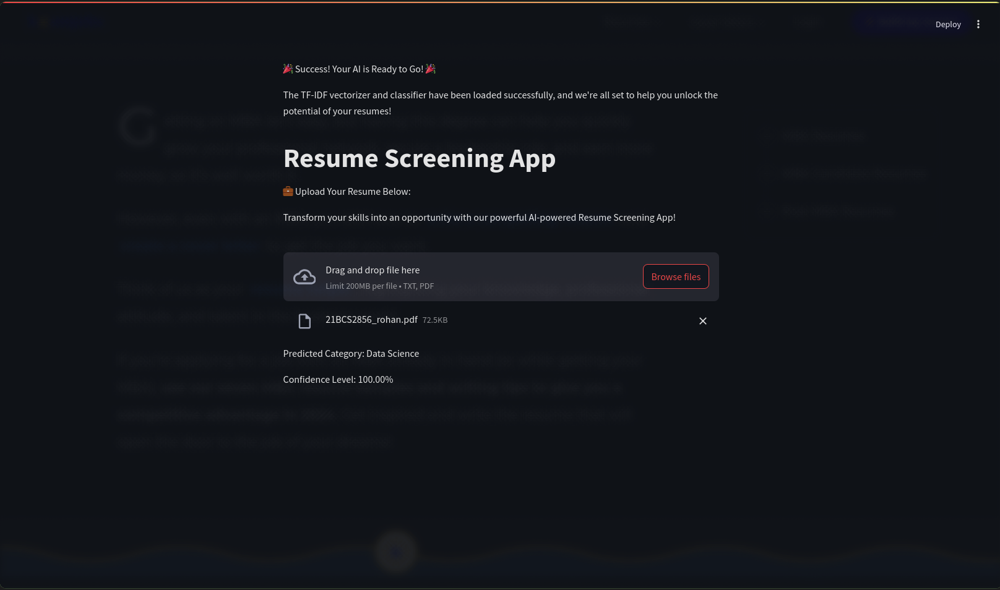
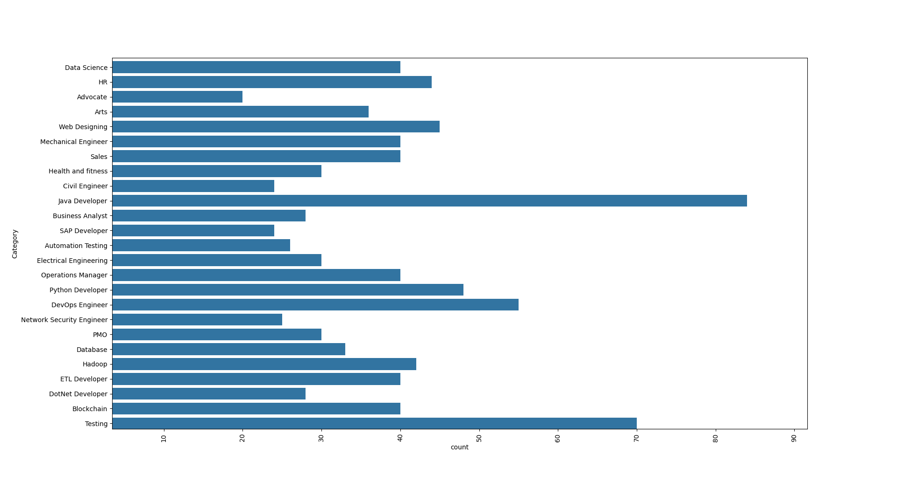
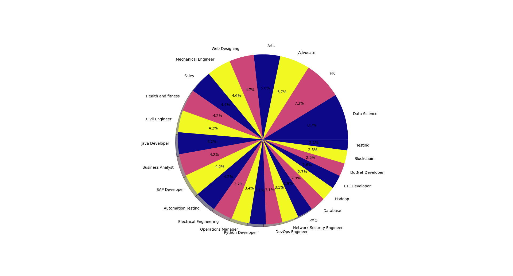

# Resume Screener

## Installation
To set up the project locally, follow these steps:

1. Clone the repository:

   ```sh
   git clone https://github.com/deadrohan19/Resume-screener.git
   
2. Create virtual enviroinment:

   ```sh
   python -m venv venv

3. Activate virtual enviroinment:

    ```sh
    source venv/bin/activate  # On Windows, use `venv\Scripts\activate`

3. Install requirements:

   ```sh
   pip install -r requirements.txt
   
4. Train models:

   ```sh
   python models.py

5. Run webapp:

    ```sh 
    streamlit run app.py

## Outputs






